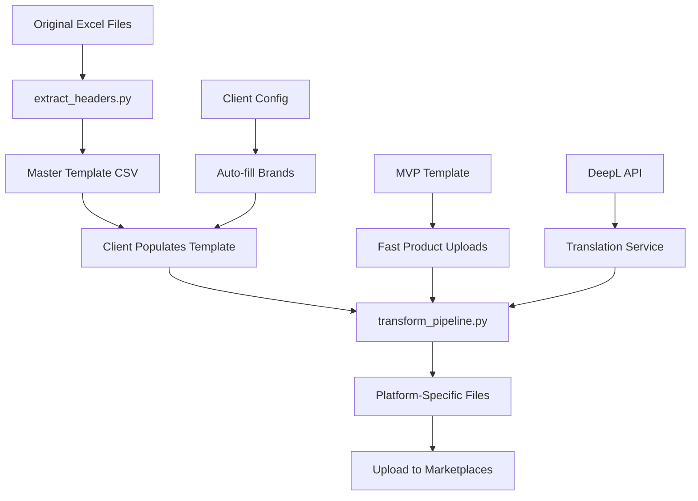

# 🚀 Multimarketplace Upload System

A comprehensive, modular solution for managing product uploads across multiple marketplace platforms with automated translation, transformation capabilities, and client-specific configurations.

## 📋 Table of Contents

- [Quick Start](#-quick-start)
- [Project Structure](#-project-structure)
- [Features](#-features)
- [Supported Marketplaces](#-supported-marketplaces)
- [MVP Template](#-mvp-template)
- [DeepL Translation Integration](#-deepl-translation-integration)
- [Client Configuration](#-client-configuration)
- [Usage Instructions](#-usage-instructions)
- [Advanced Features](#-advanced-features)
- [Troubleshooting](#-troubleshooting)
- [API Documentation](#-api-documentation)

## 🚀 Quick Start

### 1. Installation

```bash
# Clone the repository
git clone <repository-url>
cd product_manager

# Install dependencies
pip install -r requirements.txt
```

### 2. Basic Usage

```bash
# Extract headers from marketplace files
python main.py extract-headers

# Create MVP template (minimal required fields)
python main.py create-mvp

# Generate sample data for testing
python main.py generate-sample

# Optimize template to XLSX with color coding
python main.py optimize-template

# Transform template to platform-specific files
python main.py transform

# List all supported platforms
python main.py list-platforms

# Validate template for all platforms
python main.py validate
```

### 3. DeepL Translation Setup

```bash
# Setup DeepL API key
python main.py deepl-setup

# Check usage
python main.py deepl-usage

# Test translation
python main.py deepl-test
```

## 📁 Project Structure

```
product_manager/
├── 📁 src/                          # Source code
│   ├── 📁 core/                     # Core functionality
│   │   ├── transformer.py          # Transformation pipeline
│   │   └── validator.py            # Validation logic
│   ├── 📁 config/                   # Configuration files
│   │   ├── platforms.py            # Platform configurations
│   │   ├── field_mappings.py       # Field name mappings
│   │   ├── deepl_config.py         # DeepL API configuration
│   │   ├── deepl_config.py         # DeepL API configuration
│   │   └── settings.py             # Global settings
│   ├── 📁 utils/                    # Utility functions
│   │   ├── template_optimizer.py   # Template optimization
│   │   ├── translation.py          # Translation utilities
│   │   └── field_handler.py       # Field processing
│   └── 📁 scripts/                  # Executable scripts
│       ├── create_mvp_template.py  # MVP template creator
│       └── manage_deepl.py         # DeepL management
├── 📁 data/                         # Data files
│   ├── 📁 input/                    # Original marketplace files
│   ├── 📁 templates/                # Template files
│   ├── 📁 output/                   # Generated files
│   └── 📁 config/                   # Configuration files
├── 📁 docs/                         # Documentation
├── 📁 tests/                        # Test files
│   └── generate_sample_data.py     # Sample data generator
├── 📁 examples/                     # Example files
├── requirements.txt                 # Python dependencies
└── main.py                         # Main entry point
```

## ✨ Features

### 🎯 MVP Template System
- **Minimal Required Fields**: Only 6 essential fields for fast product uploads
- **Cross-Platform Compatibility**: Works for all marketplace platforms
- **Fast Data Entry**: Get products online quickly with minimal data
- **Iterative Enhancement**: Add more data later as needed

### 🌐 DeepL Translation Integration
- **Professional Translation**: High-quality DeepL API integration
- **Usage Tracking**: Stay within free tier limits (500k characters/month)
- **Automatic Fallback**: Graceful degradation when limits exceeded
- **Multi-language Support**: All DeepL supported languages

### 🎯 Simple Local Tool
- **No Client Configuration**: Direct field mappings
- **Fast Onboarding**: Immediate use without setup
- **Auto-Population**: Duplicate fields filled automatically
- **Translation Ready**: DeepL integration for multilingual content

### 🎨 Template Optimization
- **XLSX Format**: User-friendly Excel format with color coding
- **Visual Guidance**: Red (required), Green (automated), Yellow (optional)
- **Dropdown Validation**: Smart dropdowns for standardized fields
- **Logical Ordering**: Related fields grouped together

### 🔄 Unified Field System
- **Field Name Mapping**: Standardize field names across platforms
- **Unified Color Fields**: Single "Colour" field with backend mapping
- **Smart Transformation**: Automatic field mapping during transformation
- **Platform Compatibility**: Works with all marketplace requirements

## 📊 Supported Marketplaces

| Platform | Language | Key Fields | Output File |
|----------|----------|------------|-------------|
| Castorama FR | French | Product Title (Mirakl), Description (Mirakl) | `Castorama_FR_generated.xlsx` |
| Castorama PL | Polish | Name, Category | `Castorama_PL_generated.xlsx` |
| Leroy Merlin | French | Product Title (Mirakl), Category | `LM_product_generated.xlsx` |
| Maxeda BE | French (BE) | Product Title (fr_BE), Description (fr_BE) | `Maxeda_BE_generated.xlsx` |
| Maxeda NL | Dutch | Product Title (nl_NL), Description (nl_NL) | `Maxeda_NL_generated.xlsx` |

## 🎯 MVP Template

The MVP template contains only the **6 minimum required fields** that appear across all platforms:

### MVP Fields:
1. **Category Code** - Maps to Category (Castorama), Product Category (LM)
2. **EAN** - Required by all platforms
3. **Product Title (Mirakl)** - Maps to Name (Castorama), Product Title FR/IT/ES/PT (LM)
4. **Description (Mirakl)** - Maps to Body Copy (Castorama), Long Description (LM)
5. **Image 1** - Maps to Main Image 1 (Castorama), Image Large 1 (LM)
6. **Brand** - Maps to Brand Name (Maxeda), Acquisition brand (Castorama)

### Benefits:
- **Super fast data entry** (6 fields vs 268)
- **Works for any product category**
- **One template forever**
- **Get products online quickly**
- **Add more data later as needed**

### Usage:
```bash
# Create MVP template
python main.py create-mvp

# Fill in the 6 required fields
# Transform to platform files
python main.py transform
```

## 🌐 DeepL Translation Integration

### Features
- **Professional Quality**: DeepL is known for high-quality translations
- **Usage Tracking**: Stay within free tier limits (500k characters/month)
- **Automatic Fallback**: Graceful degradation when limits exceeded
- **Multi-language Support**: All DeepL supported languages

### Setup
```bash
# Setup DeepL API key
python main.py deepl-setup

# Check usage
python main.py deepl-usage

# Test translation
python main.py deepl-test
```

### Free Tier Limits
- **Monthly Characters**: 500,000 characters per month
- **Daily Requests**: 1,000 requests per day
- **Concurrent Requests**: 1 concurrent request

### Usage Monitoring
```bash
# Check current usage
python main.py deepl-usage

# Output example:
📊 DeepL Usage Summary
========================================
📅 Daily Usage:
   Characters: 1,234 / 500,000
   Requests: 5 / 1,000
   Remaining: 498,766 chars, 995 requests

📅 Monthly Usage:
   Characters: 15,678 / 500,000
   Requests: 45
   Remaining: 484,322 chars
```

## 🎯 Simple Local Tool

### Fast Onboarding
- **No Configuration Needed**: Start using immediately
- **Direct Field Mappings**: Simple, predictable behavior
- **Auto-Population**: Duplicate fields filled automatically
- **Translation Ready**: DeepL integration for multilingual content

### Usage
```bash
# Create MVP template
python main.py create-mvp

# Fill in the template
# Run transformation
python main.py transform
```

### Benefits
- **Immediate Use**: No setup or configuration required
- **Fast Onboarding**: Get clients started quickly
- **Simple Maintenance**: Direct field mappings
- **Translation Support**: DeepL integration for multilingual content

## 📋 Usage Instructions

### For Fast Product Uploads (MVP)
1. **Create MVP template**: `python main.py create-mvp`
2. **Fill in 6 required fields** in the MVP template
3. **Run transformation**: `python main.py transform`
4. **Upload to marketplaces** for fast product listing

### For Complete Product Data
1. **Optimize template**: `python main.py optimize-template`
2. **Fill required fields** (red columns) in the master template
3. **Add optional fields** (yellow columns) as needed
4. **Run transformation**: `python main.py transform`
5. **Review generated files** and upload to marketplaces

### For Translation
1. **Setup DeepL**: `python main.py deepl-setup`
2. **Check usage**: `python main.py deepl-usage`
3. **Test translation**: `python main.py deepl-test`
4. **Use in transformation**: Translation happens automatically

## 🔧 Advanced Features

### Template Optimization
The master template features:
- **269 columns** with comprehensive field coverage
- **Color coding**: Red (required), Green (automated), Yellow (optional)
- **Dropdown validation** for standardized fields
- **Logical column ordering** for easy data entry
- **Auto-width columns** for optimal readability

### Field Mapping System
- **Unified field names** across platforms
- **Automatic field mapping** during transformation
- **Platform-specific validation** rules
- **Smart dropdown value translation**

### Validation System
- **Required field checking** for each platform
- **Format validation** for data types
- **Image and asset verification**
- **Language content validation**

## 🛠️ Troubleshooting

### XLSX Template Issues
If the XLSX template shows as "broken":
1. **Check file format**: Ensure it's a valid Excel file
2. **Verify data validation**: Dropdowns should work correctly
3. **Test file loading**: Use `pd.read_excel()` to verify
4. **Recreate template**: Run `python main.py optimize-template`

### DeepL Translation Issues
If translation fails:
1. **Check API key**: Verify DeepL API key is set correctly
2. **Check usage limits**: Ensure you're within free tier limits
3. **Test connection**: Run `python main.py deepl-test`
4. **Check fallback**: System should use placeholders if limits exceeded

### Client Configuration Issues
If client-specific brands don't work:
1. **Check client config**: Verify `data/config/clients.csv`
2. **List clients**: Run `python src/scripts/manage_clients.py list`
3. **Show client details**: Check specific client configuration
4. **Update brands**: Use `python src/scripts/manage_clients.py update`

## 📚 API Documentation

### Core Modules


#### `src/core/transformer.py`
- **MultimarketplaceTransformer**: Transforms master template into platform-specific files
- **Methods**: `generate_platform_file()`, `validate_required_fields()`, `save_platform_file()`

#### `src/utils/template_optimizer.py`
- **TemplateOptimizer**: Optimizes templates with color coding and dropdown validation
- **Methods**: `optimize_template()`, `_apply_color_coding()`, `_add_dropdown_validation()`

#### `src/utils/translation.py`
- **DeepLService**: DeepL API integration with usage tracking
- **Methods**: `translate()`, `can_translate()`, `record_translation()`

### Configuration Files

#### `src/config/platforms.py`
- **PlatformConfig**: Configuration class for marketplace platforms
- **PLATFORM_CONFIGS**: Dictionary of all platform configurations
- **LANGUAGE_MAPPING**: Language codes for each platform

#### `src/config/field_mappings.py`
- **FIELD_NAME_MAPPINGS**: Field name variations across platforms
- **DROPDOWN_VALUE_MAPPINGS**: Standardized dropdown values
- **UNIFIED_FIELDS**: Unified field system for similar fields

#### `src/config/deepl_config.py`
- **DeepLUsageTracker**: Usage tracking for DeepL API
- **Methods**: `can_translate()`, `record_translation()`

## 🚀 Workflow



## 📈 Benefits

- **Modular Design**: Clean separation of concerns
- **Maintainability**: Easy to find and modify code
- **Testability**: Clear structure for unit tests
- **Scalability**: Easy to add new features
- **Documentation**: Organized documentation structure
- **Data Management**: Clear separation of input/output data
- **Configuration**: Centralized platform configurations
- **Reusability**: Modular code structure

## 🔮 Future Enhancements

- **Real-time translation**: Integrate with translation APIs
- **Automated validation**: Add comprehensive data quality checks
- **Bulk processing**: Handle large product catalogs efficiently
- **API integration**: Connect directly to marketplace APIs
- **Dashboard**: Web interface for template management
- **Version control**: Track changes to product data
- **Analytics**: Monitor upload success rates and performance

## 📞 Support

For questions or issues:
1. Check the generated files for accuracy
2. Review error messages in the console output
3. Verify template data completeness
4. Ensure all required fields are populated

---

**Status**: ✅ Production Ready  
**Last Updated**: December 2024  
**Version**: 2.0.0 