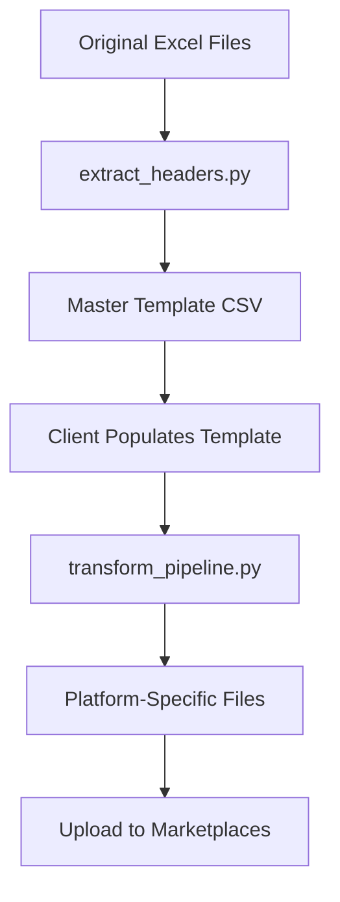

# Multimarketplace Upload System

A comprehensive solution for managing product uploads across multiple marketplace platforms with automated translation and transformation capabilities.

## 🎯 Overview

This system creates a unified master template that consolidates all unique column headers from multiple marketplace upload files. Once populated, it can automatically generate platform-specific upload files with appropriate translations and formatting.

## 📁 Project Structure

```
product_manager/
├── 📄 extract_headers.py                    # Extracts headers from Excel files
├── 📄 generate_sample_data.py              # Creates sample product data
├── 📄 transform_pipeline.py                # Main transformation engine
├── 📄 multimarketplace_master_template.csv # Master template (269 columns)
├── 📄 sample_master_template.csv           # Sample populated template
├── 📄 template_summary.md                  # Template analysis
├── 📄 README.md                           # This documentation
└── 📁 Generated Files/
    ├── Castorama_FR_generated.xlsx
    ├── Castorama_PL_generated.xlsx
    ├── LM_product_generated.xlsx
    ├── Maxeda_BE_generated.xlsx
    └── Maxeda_NL_generated.xlsx
```

## 🚀 Quick Start

### 1. Extract Headers from Original Files
```bash
python extract_headers.py
```
This creates `multimarketplace_master_template.csv` with all 269 unique columns.

### 2. Generate Sample Data (Optional)
```bash
python generate_sample_data.py
```
This creates `sample_master_template.csv` with 5 sample products for testing.

### 3. Run Transformation Pipeline
```bash
python transform_pipeline.py
```
This generates platform-specific Excel files from the master template.

## 📊 Supported Marketplaces

| Platform | Language | Key Fields | Output File |
|----------|----------|------------|-------------|
| Castorama FR | French | Product Title (Mirakl), Description (Mirakl) | `Castorama_FR_generated.xlsx` |
| Castorama PL | Polish | Name, Category | `Castorama_PL_generated.xlsx` |
| Leroy Merlin | French | Product Title (Mirakl), Category | `LM_product_generated.xlsx` |
| Maxeda BE | French (BE) | Product Title (fr_BE), Description (fr_BE) | `Maxeda_BE_generated.xlsx` |
| Maxeda NL | Dutch | Product Title (nl_NL), Description (nl_NL) | `Maxeda_NL_generated.xlsx` |

## 🔧 System Components

### 1. Header Extraction (`extract_headers.py`)
- **Purpose**: Analyzes original marketplace files to extract all unique column headers
- **Input**: 5 Excel files from different marketplaces
- **Output**: Unified CSV template with 269 columns
- **Features**:
  - Preserves original column names and formatting
  - Eliminates duplicates
  - UTF-8 encoding
  - CSV format for compatibility

### 2. Sample Data Generator (`generate_sample_data.py`)
- **Purpose**: Creates realistic sample product data for testing
- **Features**:
  - 5 sample products across different categories
  - Complete field population
  - Realistic product specifications
  - Image URL placeholders
  - Multilingual content preparation

### 3. Transformation Pipeline (`transform_pipeline.py`)
- **Purpose**: Converts master template into platform-specific files
- **Features**:
  - Platform-specific field mapping
  - Automated translation placeholders
  - Validation of required fields
  - Excel output format
  - Error handling and reporting

## 📋 Master Template Structure

The master template contains 269 columns organized into categories:

### Core Product Information
- Basic details (EAN, Brand, Name, Category)
- Physical specifications (dimensions, weight, materials)
- Product identifiers (SKU, Product ID)

### Multilingual Support
- Product titles in multiple languages (ES, FR, IT, PT, BE, NL)
- Descriptions in different languages
- Language-specific USPs and features

### Technical Documentation
- Safety data sheets
- Performance declarations
- Instruction manuals
- Technical documents

### Visual Assets
- Multiple image fields (Image 1-10, Large images, Secondary images)
- Video support
- Gallery assets

### Compliance & Certification
- Energy labels for different markets
- FSC/PEFC wood certification
- CE/UKCA marking
- Safety information

## 🔄 Workflow



## 🛠️ Customization

### Adding New Marketplaces
1. Add platform configuration to `transform_pipeline.py`
2. Define required fields and language mappings
3. Specify output filename and column requirements

### Translation Integration
The system includes placeholder translation functions. To integrate real translation services:

```python
def translate_content(self, text: str, target_language: str) -> str:
    # Replace with actual translation API calls
    # - Google Translate API
    # - DeepL API
    # - Azure Translator
    # - Custom translation service
    pass
```

### Validation Rules
Add platform-specific validation in `validate_required_fields()` method.

## 📈 Benefits

- **Single Source of Truth**: One template for all marketplaces
- **Efficiency**: Fill once, generate multiple platform files
- **Consistency**: Standardized data across all marketplaces
- **Scalability**: Easy to add new marketplaces
- **Quality Control**: Centralized validation and error handling

## 🔍 Quality Assurance

### Data Validation
- Required field checking
- Format validation
- Image and asset verification
- Language content validation

### Error Handling
- Missing field detection
- Translation error handling
- File generation error reporting
- Platform-specific validation

## 📝 Usage Instructions

### For Clients
1. **Populate the master template** with English content and core product details
2. **Run the transformation pipeline** to generate platform-specific files
3. **Review generated files** for accuracy and completeness
4. **Upload to respective marketplaces**

### For Developers
1. **Extend platform configurations** in `transform_pipeline.py`
2. **Integrate translation services** for automated language conversion
3. **Add validation rules** for data quality assurance
4. **Implement monitoring** for pipeline performance

## 🔮 Future Enhancements

- **Real-time translation**: Integrate with translation APIs
- **Automated validation**: Add comprehensive data quality checks
- **Bulk processing**: Handle large product catalogs efficiently
- **API integration**: Connect directly to marketplace APIs
- **Dashboard**: Web interface for template management
- **Version control**: Track changes to product data
- **Analytics**: Monitor upload success rates and performance

## 📞 Support

For questions or issues:
1. Check the generated files for accuracy
2. Review error messages in the console output
3. Verify template data completeness
4. Ensure all required fields are populated

---

**Status**: ✅ Production Ready  
**Last Updated**: December 2024  
**Version**: 1.0.0 