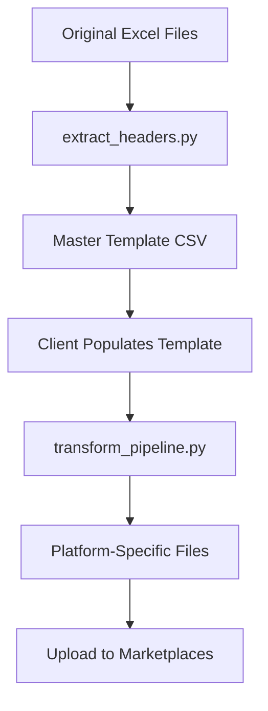

# 🚀 Multimarketplace Upload System

A comprehensive, modular solution for managing product uploads across multiple marketplace platforms with automated translation and transformation capabilities.

## 📁 Project Structure

```
product_manager/
├── 📁 src/                          # Source code
│   ├── 📁 core/                     # Core functionality
│   │   ├── extractor.py            # Header extraction logic
│   │   ├── transformer.py          # Transformation pipeline
│   │   └── validator.py            # Validation logic
│   ├── 📁 config/                   # Configuration files
│   │   ├── platforms.py            # Platform configurations
│   │   └── settings.py             # Global settings
│   ├── 📁 utils/                    # Utility functions
│   │   ├── file_utils.py           # File handling utilities
│   │   └── translation.py          # Translation utilities
│   └── 📁 scripts/                  # Executable scripts
│       ├── extract_headers.py      # Header extraction script
│       ├── generate_sample_data.py # Sample data generator
│       └── transform_pipeline.py   # Main transformation script
├── 📁 data/                         # Data files
│   ├── 📁 input/                    # Original marketplace files
│   ├── 📁 templates/                # Template files
│   └── 📁 output/                   # Generated files
├── 📁 docs/                         # Documentation
├── 📁 tests/                        # Test files
├── 📁 examples/                     # Example files
├── requirements.txt                 # Python dependencies
├── setup.py                        # Package setup
└── main.py                         # Main entry point
```

## 🚀 Quick Start

### 1. Installation

```bash
# Clone the repository
git clone <repository-url>
cd product_manager

# Install dependencies
pip install -r requirements.txt
```

### 2. Basic Usage

```bash
# Extract headers from marketplace files
python main.py extract-headers

# Generate sample data for testing
python main.py generate-sample

# Optimize template to XLSX with color coding
python main.py optimize-template

# Transform template to platform-specific files
python main.py transform

# List all supported platforms
python main.py list-platforms

# Validate template for all platforms
python main.py validate
```

### 3. Advanced Usage

```bash
# Run individual scripts
python src/scripts/extract_headers.py
python src/scripts/transform_pipeline.py
python src/scripts/generate_sample_data.py
python src/scripts/optimize_template.py
```

## 📊 Supported Marketplaces

| Platform | Language | Key Fields | Output File |
|----------|----------|------------|-------------|
| Castorama FR | French | Product Title (Mirakl), Description (Mirakl) | `Castorama_FR_generated.xlsx` |
| Castorama PL | Polish | Name, Category | `Castorama_PL_generated.xlsx` |
| Leroy Merlin | French | Product Title (Mirakl), Category | `LM_product_generated.xlsx` |
| Maxeda BE | French (BE) | Product Title (fr_BE), Description (fr_BE) | `Maxeda_BE_generated.xlsx` |
| Maxeda NL | Dutch | Product Title (nl_NL), Description (nl_NL) | `Maxeda_NL_generated.xlsx` |

## 🔧 System Architecture

### Core Modules (`src/core/`)

#### `extractor.py`
- **HeaderExtractor**: Extracts and consolidates headers from marketplace files
- **Methods**: `extract_headers_from_excel()`, `consolidate_headers()`, `create_master_template()`

#### `transformer.py`
- **MultimarketplaceTransformer**: Transforms master template into platform-specific files
- **Methods**: `generate_platform_file()`, `validate_required_fields()`, `save_platform_file()`

### Configuration (`src/config/`)

#### `platforms.py`
- **PlatformConfig**: Configuration class for marketplace platforms
- **PLATFORM_CONFIGS**: Dictionary of all platform configurations
- **LANGUAGE_MAPPING**: Language codes for each platform

#### `settings.py`
- **File paths**: Centralized path management
- **Settings**: Global configuration constants
- **Validation**: Path and file existence checks

### Utilities (`src/utils/`)

#### `translation.py`
- **translate_content()**: Main translation function (placeholder)
- **TranslationService**: Base class for translation services
- **GoogleTranslateService**: Google Translate API integration
- **DeepLService**: DeepL API integration

## 📋 Master Template Structure

The master template contains **269 columns** organized into categories with color coding:

### 🎨 Color Coding System
- **🔴 Red**: Required fields (Category Code, EAN, Brand, Code for internal use, Description, etc.)
- **🟢 Green**: Automated fields (translations, additional images)
- **🟡 Yellow**: Optional fields (technical specs, compliance, marketing content)

### 📊 Template Features
- **Excel Format**: Easy to edit and navigate
- **Logical Ordering**: Related fields grouped together
- **Visual Guidance**: Color coding shows field priorities
- **Auto-width**: Columns sized for optimal readability

### Core Product Information
- Basic details (EAN, Brand, Name, Category)
- Physical specifications (dimensions, weight, materials)
- Product identifiers (SKU, Product ID)

### Multilingual Support
- Product titles in multiple languages (ES, FR, IT, PT, BE, NL)
- Descriptions in different languages
- Language-specific USPs and features

### Technical Documentation
- Safety data sheets
- Performance declarations
- Instruction manuals
- Technical documents

### Visual Assets
- Multiple image fields (Image 1-10, Large images, Secondary images)
- Video support
- Gallery assets

### Compliance & Certification
- Energy labels for different markets
- FSC/PEFC wood certification
- CE/UKCA marking
- Safety information

## 🔄 Workflow



## 🛠️ Customization

### Adding New Marketplaces

1. **Add platform configuration** in `src/config/platforms.py`:
```python
'new_platform': PlatformConfig(
    name='New Platform',
    required_fields=['EAN', 'Brand', 'Name'],
    language_fields={
        'title': 'Product Title',
        'description': 'Description',
    },
    image_fields=['Image 1', 'Image 2'],
    output_filename='New_Platform_generated.xlsx'
)
```

2. **Add language mapping**:
```python
LANGUAGE_MAPPING['new_platform'] = 'en'
```

### Translation Integration

Replace the placeholder translation function in `src/utils/translation.py`:

```python
def translate_content(text: str, target_language: str) -> str:
    # Replace with actual translation API calls
    # - Google Translate API
    # - DeepL API
    # - Azure Translator
    # - Custom translation service
    pass
```

### Validation Rules

Add platform-specific validation in `src/core/transformer.py`:

```python
def validate_required_fields(self, df: pd.DataFrame, platform: str) -> List[str]:
    # Add custom validation logic
    pass
```

## 📈 Benefits

- **Modular Design**: Clean separation of concerns
- **Maintainability**: Easy to find and modify code
- **Testability**: Clear structure for unit tests
- **Scalability**: Easy to add new features
- **Documentation**: Organized documentation structure
- **Data Management**: Clear separation of input/output data
- **Configuration**: Centralized platform configurations
- **Reusability**: Modular code structure

## 🔍 Quality Assurance

### Data Validation
- Required field checking
- Format validation
- Image and asset verification
- Language content validation

### Error Handling
- Missing field detection
- Translation error handling
- File generation error reporting
- Platform-specific validation

## 📝 Usage Instructions

### For Clients
1. **Populate** the master template with English content and core product details
2. **Run** `python main.py transform` to generate platform files
3. **Review** generated files for accuracy
4. **Upload** to respective marketplaces

### For Developers
1. **Extend platform configurations** in `src/config/platforms.py`
2. **Integrate translation services** in `src/utils/translation.py`
3. **Add validation rules** in `src/core/transformer.py`
4. **Implement monitoring** for pipeline performance

## 🧪 Testing

```bash
# Run all tests
pytest

# Run specific test modules
pytest tests/test_extractor.py
pytest tests/test_transformer.py
pytest tests/test_validator.py
```

## 📚 Documentation

- **API Documentation**: See `docs/API.md`
- **Platform Guides**: See `docs/PLATFORMS.md`
- **Deployment Guide**: See `docs/DEPLOYMENT.md`

## 🔮 Future Enhancements

- **Real-time translation**: Integrate with translation APIs
- **Automated validation**: Add comprehensive data quality checks
- **Bulk processing**: Handle large product catalogs efficiently
- **API integration**: Connect directly to marketplace APIs
- **Dashboard**: Web interface for template management
- **Version control**: Track changes to product data
- **Analytics**: Monitor upload success rates and performance

## 📞 Support

For questions or issues:
1. Check the generated files for accuracy
2. Review error messages in the console output
3. Verify template data completeness
4. Ensure all required fields are populated

---

**Status**: ✅ Production Ready  
**Last Updated**: December 2024  
**Version**: 2.0.0 